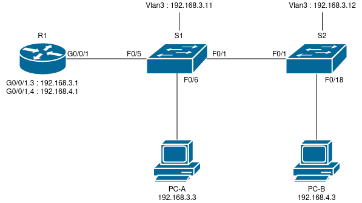

# Лабораторная работа 1.

## Цели работы

Настройка DTP.

Добавление сетей VLAN и назначение портов.

## Задачи

 1. Воспроизведение схемы сети (согласно Рис. 1) и базовая настройка оборудования.
 2. Настройка VLAN и назначение портов (согласно Табл. 1 и 2).
 3. Проверка корректности выполненной конфигурации.

--- 
 
**Рис. 1. - Схема сети**

---

**Табл. 1. - Таблица адресов**

Устройство | Интерфейс | IP-адрес | Маска | Шлюз
--|--|--|--|--
R1 | G0/0/1.3 | 192.168.3.1 | 255.255.255.0 | -
| G0/0/1.4 | 192.168.4.1 | 255.255.255.0 | -
| G0/0/1.8 | - | - | -
S1 | Vlan3 | 192.168.3.11 | 255.255.255.0 | 192.168.3.1
S2 | Vlan3 | 192.168.3.12 | 255.255.255.0 | 192.168.3.1
PC-A | NIC | 192.168.3.3 | 255.255.255.0 | 192.168.3.1
PC-B | NIC | 192.168.3.4 | 255.255.255.0 | 192.168.4.1

---

**Табл. 2. - Таблица VLAN**

VLAN | Name | Iface assigned
|--|--|--
3 | Management | S1: Vlan3
|  | S2: Vlan3
|  | S1: F0/6
| 4 | Operations | S2: F0/18
| 7 | ParkingLot | S1: F0/2-4, F0/7-24, G0/1-2
|  | S2: F0/2-17, F0/19-24, G0/1-2
8 | Native | -

---

Все конфигурационные файлы расположены в каталоге [cfg](./cfg/):

* [R1](./cfg/r1.txt)

* [S1](./cfg/s1.txt)

* [S2](./cfg/s2.txt)

---

## Выполнение

### Воспроизведение схемы сети

На базе Cisco Packet Tracer была подготовлена схема сети, согласно Рис. 1.

Все сетевые устройства были предварительно подготовлены к работе, а именно:

1.  Устройства проименованы.

        hostname DEVICE_NAME

2. Обеспечено ограничение доступа к сетевым устройствам путем ограничения доступа к привилегированному режиму.

        enable secret ENB_PASSWORD

3. Ограничен доступ через консоль.

        line console 0
        password LOG_PASSWORD
        login
        exit

4. Ограничен доступ через виртуальные терминалы.

        line vty 0 15
        password LOG_PASSWORD
        login
        exit

5. Обеспечена защита паролей, путем активации сервиса, отвечающего за их хранение в шифрованном виде.

        service password-encryption

6. Актуализирована дата и время на устройстве.

        clock set HH:MM:ss Month DD YYYY

7. Добавлено сообщение о недопустимости неавторизованного доступа.

        banner motd $ Unauthorized access is prohibited!$

8. Дополнительно: 

    - Отключена функция поиска по доменному имени.

            no ip domain-lookup

    - В консоли включена функция синхронизированного вывода сообщений.

            line console 0
            logging synchronous
            exit

> ENB_PASSWORD и LOG_PASSWORD указаны в документации к лабораторной работе.

Все вышеперечисленные действия выполнялись из привелегированного режима. Все действия, кроме установки времени (6) выполнялись из режима конфигурации (`configure terminal`).

Для конечных устройств PC-A и PC-B также была произведена настройка IP адресов, согласно Табл. 1.
(Данная настройка производилась из GUI Cisco Packet Tracer)

### Настройка VLAN и назначение портов

На данном этапе на устройствах S1, S2 были созданы VLAN с номерами 3, 4, 7, 8:

    configure terminal
    
    vlan 3
    name Management
    exit

    vlan 4
    name Operations
    exit

    vlan 7
    name ParkingLot
    exit

    vlan 8
    name Native
    exit

Также, произведено перераспределение интерфейсов данных устройств между указанными VLAN согласно Табл. 2.

Интерфейсы S1:F0/1, S1:F0/5, S2:F0/1 были переведены в режим trunk, передача данных на них была ограничена VLAN 3, 4 и 8. VLAN 8 на них указан в качестве native vlan.

**S1**:

    configure terminal

    interface range FastEthernet 0/1-24, GigabitEthernet 0/1-2
    switchport mode access
    switchport access vlan 7
    exit

    interface range FastEthernet0/1, FastEthernet0/5
    switchport mode trunk
    switchport trunk native vlan 8
    switchport trunk allowed vlan 3-4,8
    exit

    interface FastEthernet0/6
    switchport access vlan 3
    exit

---

**S2**:

    configure terminal

    interface range FastEthernet0/1-24, GigabitEthernet0/1-2
    swichport mode access
    switchport access vlan 7
    exit

    interface FastEthernet 0/1
    switchport mode trunk
    switchport trunk native vlan 8
    switchport trunk allowed vlan 3-4,8
    exit

    interface FastEthernet 0/18
    switchport access vlan 4
    exit

---

Согласно Табл.1 были созданы и настроены виртуальные интерфейсы на устройствах S1 и S2, а также подинтерфейсы для R1, с настройкой каждого под отдельный vlan. На все интерфейсы кроме Ge0/0/1.8 R1 также были назначены ip-адреса, для S1 и S2 указан маршрут по умолчанию.

**S1**:

    configure terminal

    interface Vlan3
    ip address 192.168.3.11 255.255.255.0
    no shutdown
    exit

    ip default-gateway 192.168.3.1

---

**S2**:

    configure terminal

    interface Vlan3
    ip address 192.168.3.12 255.255.255.0
    no shutdown

    ip default-gateway 192.168.3.1

---

**R1**:

    configure terminal

    interface GigabitEthernet0/0/1
    no shutdown
    exit

    interface GigabitEthernet0/0/1.3
    encapsulation dot1Q 3
    ip address 192.168.3.1 255.255.255.0
    exit

    interface GigabitEthernet0/0/1.4
    encapsulation dot1Q 4
    ip address 192.168.4.1 255.255.255.0
    exit

    interface GigabitEthernet0/0/1.8
    encapsulation dot1Q 8
    exit

### Проверка корректности выполненной конфигурации

Проверка корректности выполнялась посредством проверки утилитой ping соединений между:

* PC-A -> R1 (`ping 192.168.3.11`)

* PC-A -> PC-B (`ping 192.168.3.4`)

* PC-A -> S2 (`ping 192.168.3.12`)

А также путем выполнения команды tracert с PC-B до PC-A. (`traceroute 192.168.3.3`)

Результат указанных проверок показал, что выполненная конфигурация является работоспособной.
