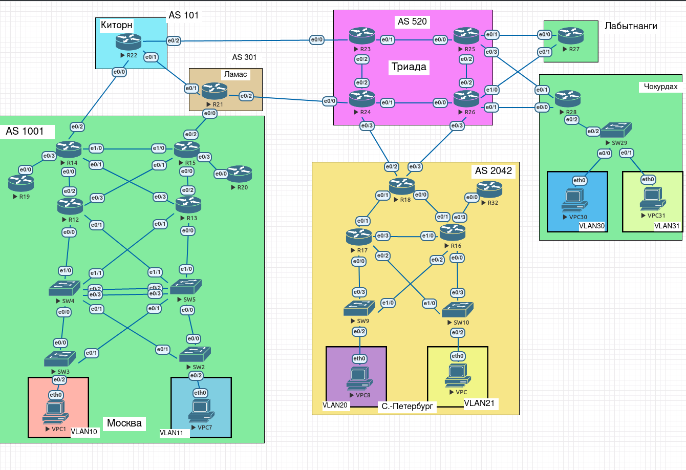

# Лабораторная работа 11.

## Цели работы

1. Настроить фильтрацию для офиса Москва.
2. Настроить фильтрацию для офиса С.-Петербург.

## Задачи

1. Настроить фильтрацию в офисе Москва так, чтобы не появилось транзитного трафика (As-path).
2. Настроить фильтрацию в офисе С.-Петербург так, чтобы не появилось транзитного трафика (Prefix-list).
3. Настроить провайдера Киторн так, чтобы в офис Москва отдавался только маршрут по-умолчанию.
4. Настроить провайдера Ламас так, чтобы в офис Москва отдавался только маршрут по-умолчанию и префикс офиса С.-Петербург.

## План работ

1. Настройка фильтрации: Москва.
2. Настройка фильтрации: С.-Петербург.
3. Настройка фильтрации: Киторн.
4. Настройка фильтрации: Ламас.

--- 
 
**Рис. 1. - Общая схема сети.**

---

Все конфигурационные файлы расположены в каталоге [cfg](./cfg/).

---

#### Изменения в топологии в последующих работах.

Не зафиксировано.

---

#### Изменения в топологии по отношению к предыдущим работам.

1. Снят iBGP между С.-Петербург и Москва. (Также удалены связанные access-list`ы)
2. Организован OSPF между C.-Петербург и Москва с `redistribute eigrp` и `redistribute ospf` соответственно.
3. На площадке Москва убрано анонсирование сети 10.1.0.0/8 в BGP.
4. Основа базовой фильтрации изменена с `permit 10.255.0.0/24`, на `deny 10.96.0.0/16`.
5. На площадке Москва создан статический маршрут `200.200.200.0/24` на `Null0`, опубликован в BGP (R18).
6. На площадке С.-Петербург создан статический маршрут `100.100.100.0/24` на `Null0`, опубликован в BGP (R14).

---

## Выполнение

### Настройка фильтрации: Москва.

> Выполняется на R14 и R15.

1. Убираем ранее созданный лист `GENERAL-restrict`, отвязываем от внешнего соседа.
2. Создаем as-path access-list:

        ip as-path access-list 1 permit ^$
        ip as-path access-list 1 deny .* 
        
3. Создаем peer-policy шаблон, привязываем filter-list на исходящее направление.

        template peer-policy GENERAL-out
          filter-list 1 out
          
4. Подтягиваем шаблон к внешнему соседу (`IP_NEIGH` - адрес соседа).

        neighbor <IP_NEIGH> inherit peer-policy GENERAL-out

5. На R21 и R22 проверяем командой `show ip bgp regexp _1001_` отсутствие транзитных маршрутов со стороны R14 и R15 (на примере R22, вывод сокращен).

        R22#sh ip bgp regex _1001_

        // -- //

            Network          Next Hop            Metric LocPrf Weight Path
        *>  10.96.1.253/32   10.255.0.46                            0 1001 ?
        *   10.255.0.2/31    10.255.0.24                            0 301 1001 ?
        *>                   10.255.0.46                            0 1001 ?
        *   10.255.0.6/31    10.255.0.24                            0 301 1001 ?
        *>                   10.255.0.46                            0 1001 ?
        *   10.255.0.10/31   10.255.0.24                            0 301 1001 ?
        *>                   10.255.0.46                            0 1001 ?
        *   10.255.0.12/31   10.255.0.46                            0 1001 ?
        *   10.255.0.50/31   10.255.0.24                            0 301 1001 ?
        *>                   10.255.0.46                            0 1001 ?
        *   10.255.0.54/31   10.255.0.24                            0 301 1001 ?
        *>                   10.255.0.46                            0 1001 ?
        *   200.200.200.0    10.255.0.24                            0 301 1001 i
        *>                   10.255.0.46              0             0 1001 i

    В выводе видим, что хоть транзита нет, но анонсируются в т.ч. и внутренние маршруты.
    
6. Добавляем к шаблону `GENERAL-out` префикс-лист вида:

        prefix-list GENERAL-out permit 200.200.200.0/24
        prefix-list GENERAL-out deny 0.0.0.0/0 le 32
        
7. Повторяем запрос маршрутов с R22.

        R22#sh ip bgp regex _1001_
        
        // -- //
        
            Network          Next Hop            Metric LocPrf Weight Path
        *>  200.200.200.0    10.255.0.46              0             0 1001 i
        *                    10.255.0.24                            0 301 1001 i    
        
### Настройка фильтрации: С.-Петербург.

> Также, параметр remote-as 520 был перенесен в peer-session шаблон GENERAL-520

1. Убираем ранее созданный лист `GENERAL-restrict`, отвязываем также от соседей.
2. Создаем prefix-list:

        ip prefix-list GENERAL-LIST-out seq 5 permit 10.255.0.0/8
        ip prefix-list GENERAL-LIST-out seq 10 deny 0.0.0.0/0 le 32

3. Создаем peer-policy шаблон, подтягиваем prefix-list на исходящее направление.

        template peer-policy GENERAL-out
          prefix-list GENERAL-LIST-out out
          
4. Подтягиваем шаблон к внешнему соседу (`IP_NEIGH` - адрес соседа).

        neighbor <IP_NEIGH> inherit peer-policy GENERAL-out
        
5. На R24 и R26 проверяем командой `show ip bgp regexp _2042_` отсутствие транзитных маршрутов со стороны R18 (на примере R26, вывод сокращен):

        R26#sh ip bgp regex _2042_

        // -- //

            Network          Next Hop            Metric LocPrf Weight Path
        *>  100.100.100.0/24 10.255.0.22              0             0 2042 i

### Настройка фильтрации: Киторн.

1. Создаем filter-list, запрещающий любые префиксы:

        ip as-path access-list 500 deny .*

2. Создаем выходной шаблон для AS1001, с привязкой к листу, а также с указанием атрибута `default-originate`:

        template peer-policy GENERAL-Default-only
          filter-list 500 out
          default-originate
          
3. Назначаем шаблон на R14 (10.255.0.46), предварительно отвязав предыдущий шаблон:

        neighbor 10.255.0.46 inherit peer-policy GENERAL-Default-only
        
4. Проверяем, какие маршруты теперь приходят на R14 с AS101 (вывод сокращен):

        R14#sh ip bgp regex ^101 

        // -- //
        
            Network          Next Hop            Metric LocPrf Weight Path
        *    0.0.0.0          10.255.0.47                    90      0 101 i

    
### Настройка фильтрации: Ламас.

1. Создаем filter-list с ограничением префиксов только до AS2042:

        ip as-path access-list 1 permit _2042$
        ip as-path access-list 1 deny .*
        
2. Создаем шаблон peer-policy для R15, указываем созданный список + атрибут `default-originate`.

        template peer-policy MSK-SPB
          filter-list 1 out
          default-originate
          
3. Назначаем шаблон на R15 (10.255.0.46), предварительно отвязав предыдущий:

        neighbor 10.255.0.46 inherit peer-policy MSK-SPB
        
4. Проверяем какие маршруты приходят на R15 с AS301 (вывод сокращен):

        R15#sh ip bgp regex ^301

        // -- //

            Network          Next Hop            Metric LocPrf Weight Path
        *>   0.0.0.0          10.255.0.13                   200      0 301 i
        *>   100.100.100.0/24 10.255.0.13                   200      0 301 520 2042 i
