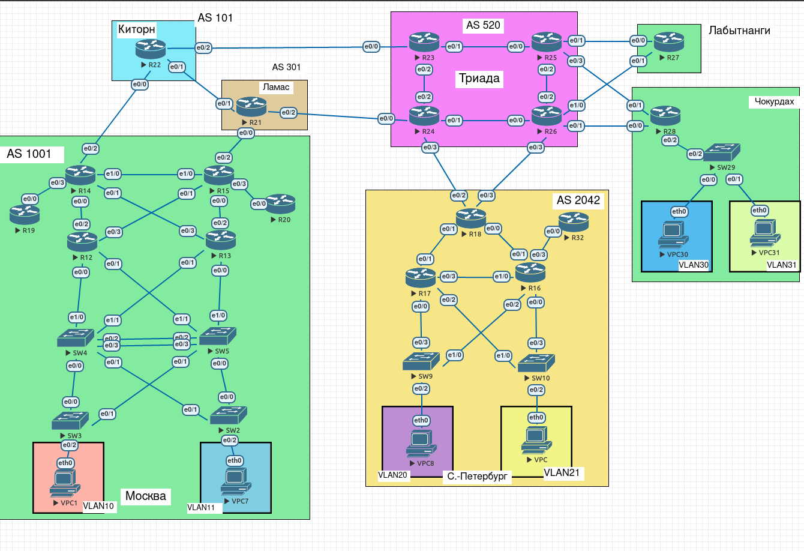

# Лабораторная работа 13.

## Цели работы

1. Настроить GRE между офисами Москва и С.-Петербург.
2. Настроить DMVPN между Москва и Чокурдах, Лабытнанги.

## Задачи

1. Настроить GRE между офисами Москва и С.-Петербург.
2. Настроить DMVPN между Москва и Чокурдах, Лабытнанги.

## План работ

1. Настроить GRE между офисами Москва и С.-Петербург.
2. Настроить DMVPN между Москва - Лабытнанги, Чокурдах.
3. Обеспечить маршрутизацию внутри DMVPN посредством EIGRP.

--- 
 
**Рис. 1. - Общая схема сети.**

---

Все конфигурационные файлы расположены в каталоге [cfg](./cfg/).

---

#### Изменения в топологии в последующих работах.

Не зафиксировано.

---

#### Изменения в топологии по отношению к предыдущим работам.

Не зафиксировано.

---

**Табл. 1 - Адресация GRE туннелей Москва - С.-Петербург.**

| Левое устройство | Л. внешн. адрес | Л. внутр. адрес | - | Правое устройство | П. внешн. адрес | П. внутр. адрес |
| -- | -- | -- | -- | -- | -- | -- |
| R14 | 10.255.0.46/31 | 10.255.0.56/31 | - | R18 | 10.255.0.20/31 | 10.255.0.57/31 |
| R15 | 10.255.0.12/31 | 10.255.0.58/31 | - | R18 | 10.255.0.22/31 | 10.255.0.59/31 | 

---

**Табл. 2 - Адресация DMVPN 100.**

| Устройство | Внутренний адрес | Выходной интерфейс | Внешний адрес |
| -- | -- | -- | -- |
| R14 | 10.4.0.1/29 | Ethernet0/2 | 10.255.0.46/31 |
| R27 | 10.4.0.2/29 | Ethernet0/0 | -Не применимо- |
| R28 | 10.4.0.3/29 | Ethernet0/0 | -Не применимо- |

---

**Табл. 3 - Адресация DMVPN 101.**

| Устройство | Внутренний адрес | Выходной интерфейс | Внешний адрес | 
| -- | -- | -- | -- |
| R15 | 10.4.0.33/29 | Ethernet0/2  | 10.255.0.12/31 |
| R27 | 10.4.0.34/29 | Ethernet0/1  | -Не применимо- |
| R28 | 10.4.0.35/29 | Ethernet0/1  | -Не применимо- |

---

**Табл. 4 - Подсети EIGRP DMVPN 100.**

| Устройство | Сеть | Wildcard |
| -- | -- | -- |
| R14 | 10.1.0.0 | 0.0.0.255 |
| | 10.4.0.0 | 0.0.0.7 |
| R27 | 10.3.1.48 | 0.0.0.7 |
| | 10.4.0.0 | 0.0.0.7 |
| R28 | 10.3.1.72 | 0.0.0.7 |
| | 10.3.1.80 | 0.0.0.7 |
| | 10.4.0.0 | 0.0.0.7 |

---

**Табл. 5 - Подсети EIGRP DMVPN 101.**

| Устройство | Сеть | Wildcard |
| -- | -- | -- |
| R15 | 10.1.0.0 | 0.0.0.255 |
| | 10.4.0.32 | 0.0.0.7 |
| R27 | 10.3.1.48 | 0.0.0.7 |
| | 10.4.0.32 | 0.0.0.7 |
| R28 | 10.3.1.72 | 0.0.0.7 |
| | 10.3.1.80 | 0.0.0.7 |
| | 10.4.0.32 | 0.0.0.7 |

---

## Выполнение

### Настроить GRE между офисами Москва и С.-Петербург.

Ранее между офисами Москва и С.-Петербург было настроено соединение посредством IPSec. В данной работе интерфейсы `R14:Tunnel0`, `R15:Tunnel0`, `R18:Tunnel0-1` остановлены и не используются.

1. Поднимаем туннель между R14 и R18:

    * R14:

            interface Tunnel10
              tunnel mode gre ip
              ip mtu 1400
              ip tcp adjust-mss 1360
              ip address <L_IN_IP_ADDR> 255.255.255.254
              tunnel source <L_OUT_IP_ADDR>
              tunnel destination <R_OUT_IP_ADDR>

    * R18:
    
            interface Tunnel10
              tunnel mode gre ip
              ip mtu 1400
              ip tcp adjust-mss 1360
              ip address <R_IN_IP_ADDR> 255.255.255.254
              tunnel source <R_OUT_IP_ADDR>
              tunnel destination <L_OUT_IP_ADDR>
    
    Где, в соответствии с Табл. 1:
    
    * `L_IN_IP_ADDR` - Л. внутр. адрес.
    * `L_OUT_IP_ADDR` - Л. внешн. адрес.
    * `R_IN_IP_ADDR` - П. внутр. адрес.
    * `R_OUT_IP_ADDR` - П. внешн. адрес.

2. Проверяем посредством команды `ping` наличие соединения:

        R18# ping 10.255.0.56      
        Type escape sequence to abort.
        Sending 5, 100-byte ICMP Echos to 10.255.0.56, timeout is 2 seconds:
        !!!!!
        Success rate is 100 percent (5/5), round-trip min/avg/max = 1/1/3 ms

3. Руководствуясь Табл. 1, повторяем п.п. 1-2 для R15 и R18. В R18, соответственно, указываем иной номер туннеля.

### Настроить DMVPN между Москва - Лабытнанги, Чокурдах.

С учетом наличия двух выходных устройств на площадке Москва, имеет смысл реализовать DMVPN Phase 3 с DualHub/DualCloud. Для адресации внутри этих соединений выделена новая подсеть 10.4.0.0/24.

1. Настраиваем первое соединение, в качестве HUB выступает R14.

    * HUB:
        
            interface Tunnel100
              tunnel mode gre multipoint
              ip address <HUB_IN_IP_ADDR> 255.255.255.248
              tunnel source <HUB_OUT_IF>
              ip mtu 1400
              ip tcp adjust-mss 1360
              ip nhrp network-id <NID>
              ip nhrp authentication <PASSWORD>
              ip nhrp map multicast dynamic
              ip nhrp holdtime 600
              ip nhrp redirect
    
    * SPOKE:
    
            interface Tunnel100
              tunnel mode gre multipoint
              ip address <SPOKE_IN_IP_ADDR> 255.255.255.248
              tunnel source <SPOKE_OUT_IF>
              ip mtu 1400
              ip tcp adjust-mss 1360
              ip nhrp network-id <NID>
              ip nhrp authentication <PASSWORD>
              ip nhrp map multicast <HUB_OUT_IP_ADDR>
              ip nhrp nhs <HUB_IN_IP_ADDR>
              ip nhrp map <HUB_IN_IP_ADDR> <HUB_OUT_IP_ADDR>
              ip nhrp holdtime 600
              ip nhrp shortcut

              
    Где, в соответствии с Табл. 2:
    
    * `{HUB,SPOKE}_IN_IP_ADDR` - Внешний адрес.
    * `{HUB,SPOKE}_OUT_IP_ADDR` - Внутренний адрес.
    * `{HUB,SPOKE}_OUT_IF` - Выходной интерфейс.
    * `NID` - ID сети.
    * `PASSWORD` - пароль для аутентификации.

2. Аналогичным образом, в соотв. с Табл. 3 настраиваем второе соединение, проверяем статус командой `show dmvpn` (на примере R28, вывод сокращен):

        R28#show dmvpn 

        // -- //

        Interface: Tunnel100, IPv4 NHRP Details 
        Type:Spoke, NHRP Peers:1, 

        # Ent  Peer NBMA Addr Peer Tunnel Add State  UpDn Tm Attrb
        ----- --------------- --------------- ----- -------- -----
            1 10.255.0.46            10.4.0.1    UP 00:00:26     S

        Interface: Tunnel101, IPv4 NHRP Details 
        Type:Spoke, NHRP Peers:1, 

        # Ent  Peer NBMA Addr Peer Tunnel Add State  UpDn Tm Attrb
        ----- --------------- --------------- ----- -------- -----
            1 10.255.0.12           10.4.0.33    UP 00:00:11     S

3. Пробуем пропинговать R27 и R28 между собой и также сразу проверяем текущие соединения (на примере R28, вывод сокращен):

        R28#ping 10.4.0.2

        Type escape sequence to abort.
        Sending 5, 100-byte ICMP Echos to 10.4.0.2, timeout is 2 seconds:
        !!!!!
        Success rate is 100 percent (5/5), round-trip min/avg/max = 2/3/6 ms

        R28#show dmvpn

        // -- //

        Interface: Tunnel100, IPv4 NHRP Details 
        Type:Spoke, NHRP Peers:2, 

        # Ent  Peer NBMA Addr Peer Tunnel Add State  UpDn Tm Attrb
        ----- --------------- --------------- ----- -------- -----
            1 10.255.0.46            10.4.0.1    UP 00:05:35     S
            1 10.255.0.39            10.4.0.2    UP 00:00:04     D

        Interface: Tunnel101, IPv4 NHRP Details 
        Type:Spoke, NHRP Peers:1, 

        # Ent  Peer NBMA Addr Peer Tunnel Add State  UpDn Tm Attrb
        ----- --------------- --------------- ----- -------- -----
            1 10.255.0.12           10.4.0.33    UP 00:05:20     S

### Обеспечить маршрутизацию внутри DMVPN посредством EIGRP.

1. На каждом из маршрутизаторов, вне зависимости от статуса (hub/spoke) создаем инстанс EIGRP с номером AS (`AS_NUM`), равным номеру Network ID. Внутри указываем подсети (`NETWORK`, `WILDCARD`). Для подсети AS 100 в соотв. с Табл. 4:

        router eigrp <AS_NUM>
        no auto-summary
        network <NETWORK> <WILDCARD>
              
2. П.1 повторяем для второго DMVPN соединения, параметры берем в соответствии с Табл. 5.

3. Дополнительно на туннельных интерфейсах хабов указываем:

        no ip split-horizon eigrp <AS_NUM>
        no ip next-hop-self eigrp <AS_NUM>

4. Получаем список соседей по EIGRP с хаба (на примере R14), удостоверяемся что все работает:

        R14#show ip eigrp neighbors 
        EIGRP-IPv4 Neighbors for AS(100)
        H   Address                 Interface              Hold Uptime   SRTT   RTO  Q  Seq
                                                        (sec)         (ms)       Cnt Num
        1   10.4.0.2                Tu100                    12 00:04:09    3  1398  0  3
        0   10.4.0.3                Tu100                    12 00:04:09    6  1398  0  3
