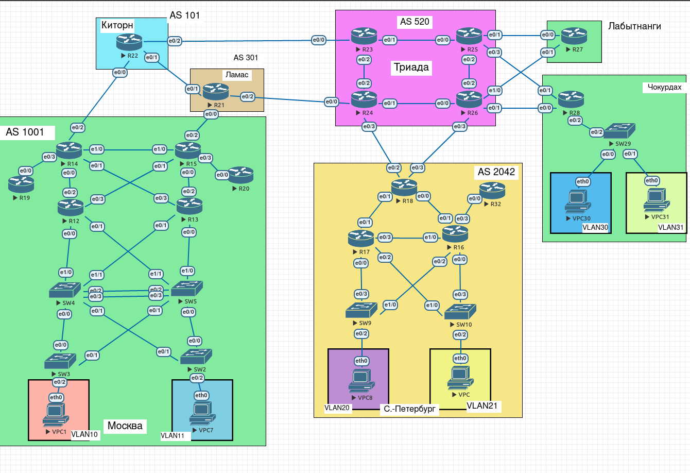

# Лабораторная работа 14.

## Цели работы

1. Настроить GRE поверх IPSec между офисами Москва и С.-Петербург
2. Настроить DMVPN поверх IPSec между офисами Москва и Чокурдах, Лабытнанги

## Задачи

1. Настроить GRE поверх IPSec между офисами Москва и С.-Петербург
2. Настроить DMVPN поверх IPSec между Москва и Чокурдах, Лабытнанги

## План работ

1. Создание общего NTP сервера.
2. Обеспечение доступности УЦ.
3. Создание удостоверяющего центра на R20.
4. Выпуск сертификатов всем участникам DMVPN+IPSec и GRE+IPSec.
5. Настройка GRE over IPSec между площадками Москва и С.-Петербург.
6. Настройка DMVPN поверх IPSec между Москва и Чокурдах, Лабытнанги.

--- 
 
**Рис. 1. - Общая схема сети.**

---

Все конфигурационные файлы расположены в каталоге [cfg](./cfg/).

---

#### Изменения в топологии в последующих работах.

Не зафиксировано.

---

#### Изменения в топологии по отношению к предыдущим работам.

Не зафиксировано.

---

**Табл. 1 - Таблица сопоставления GRE и IPSec интерфейсов.**

| Устройство | GRE | IPsec (GRE tunnel source) |
| -- | -- | -- |
| R14 | Tunnel10 | Tunnel0 |
| R15 | Tunnel10 | Tunnel0 |
| R18 | Tunnel10 | Tunnel0 |
| R18 | Tunnel11 | Tunnel1 |

---

**Табл. 2 - Таблица сопоставления номеров туннелей.**

| Номер | Устройство | Интерфейс |
| :--: | :--: | :--: |
| 0 | R14 | Tunnel0 |
| 0 | R18 | Tunnel0 |
| 1 | R15 | Tunnel0 |
| 1 | R18 | Tunnel1 |
| 2 | R14 | Tunnel100 |
| 2 | R27 | Tunnel100 |
| 2 | R28 | Tunnel100 |
| 3 | R15 | Tunnel101 |
| 3 | R27 | Tunnel101 |
| 3 | R28 | Tunnel101 |

## Выполнение

Конфигурация будет выполняться с использованием CA. Т.к. использовать CA в роли одного из участников соединения - является не очень хорошей практикой, в данной работе роль УЦ отдана R20. Соответственно, необходимо выполнить ряд подготовительных работ.

### Создание общего NTP сервера.

1. Для синхронизации времени на обеих площадках необходим централизованный NTP сервер. Предположим что Триада как раз предоставляет такой сервис на двух устройствах: R24 (10.255.0.27) и R25 (10.255.0.33). На каждом из них командой `ntp master 1` включаем NTP сервер.

2. На площадке Москва уже присутствует локальные серверы, с которыми синхронизируются все устройства. Настраиваем их синхронизацию с вышестоящим сервером:

    * R12:
        
            ntp server 10.255.0.27 prefer
            ntp server 10.255.0.33
            ntp update-calendar

    * R13: 
    
            ntp server 10.255.0.33 prefer
            ntp server 10.255.0.27
            ntp update-calendar

3. На площадке С.-Петербург NTP сервер на данный момент не требуется, достаточно только настроить R18 в качестве клиента.

    * R18:
    
            ntp server 10.255.0.27 prefer
            ntp server 10.255.0.33
            ntp update-calendar
            
### Обеспечение доступности УЦ.

Так как к нашему УЦ будут обращаться не только внутренние клиенты, необходимо вывести порт `80/tcp` наружу. Ранее R20 был выдан адрес 200.200.200.20/24. Ограничиваем доступ по данному адресу только до одного порта.

1. На R14 и R15 выполняем: 

        no ip nat inside source static 10.255.0.11 200.200.200.20
        ip nat inside source static tcp 10.255.0.11 80 200.200.200.20 80
        
### Создание удостоверяющего центра на R20.

1. Указываем доменное имя, включаем HTTP сервер.

        ip domain-name acme.com
        ip http cryptoserver
    
2. Генерируем RSA-4096 ключ (Здесь и далее `KEY_NAME` - наименование ключа, должно быть одинаковым в контексте одного маршрутизатора).

        crypto key generate rsa label <KEY_NAME> exportable modulus 4096
        
3. Настраиваем trustpoint (Здесь и далее `TP_NAME` - имя trustpoint, должно быть одинаковым в контексте одного маршрутизатора; `HOST_IP` - адрес сервера CA.).

        crypto pki trustpoint <TP_NAME>
          enrollment url http://<HOST_IP>
          subject-name CN=R20,OU=1stDept,O=ACME,C=RU
          rsakeypair <KEY_NAME>
          revocation-check crl
        exit
          
4. Включаем сервер.

        crypto pki server <KEY_NAME>
          no shutdown

> Конфигурация УЦ завершается на п.4. Пункты 5-6 выполняются сугубо в целях практики выпуска сертификатов для устройства, на котором развернут УЦ.
          
5. Создаем ещё один trustpoint (с наименованием `TP_NAME_2`) для получения собственного сертификата, т.к. автоматически созданный с ключом не подходит для получения самоподписанных сертификатов.

        crypto pki trustpoint <TP_NAME_2>
          enrollment url http://<HOST_IP>
    
6. Создаем запрос на сертификат на базе локального trustpoint.

        crypto pki authenticate <TP_NAME_2>
        crypto pki enroll <TP_NAME_2>
        
### Выпуск сертификатов всем участникам DMVPN+IPSec и GRE+IPSec.

На устройствах: R14, R15, R18, R27, R28 выполняем обращение к УЦ и выпуск сертификата, для этого создаем там trustpoint и отправляем запрос на сертификат.

1. Генерируем ключ на устройстве:
    
        crypto key generate rsa label <KEY_NAME> exportable modulus 4096

2. Создаем trustpoint, подтягиваем созданный ключ:
    
            crypto pki trustpoint <TP_NAME>
              enrollment url http://<IP_CA>
              serial-number
              rsakeypair <KEY_NAME>
    
    Где `IP_CA`:
    
        * Для R14 и R15: 10.255.0.11
        * R18, R27, R28: 200.200.200.20
          
3. Запрашиваем сертификат УЦ и создаем запрос на свой сертификат:

        crypto pki authenticate <TP_NAME>
        crypto pki enroll <TP_NAME>

4. На R20 проверяем наличие запросов командой `show crypto pki server <KEY_NAME> requests`:

        Enrollment Request Database:

        Subordinate CA certificate requests:
        ReqID  State      Fingerprint                      SubjectName
        --------------------------------------------------------------

        RA certificate requests:
        ReqID  State      Fingerprint                      SubjectName
        --------------------------------------------------------------

        Router certificates requests:
        ReqID  State      Fingerprint                      SubjectName
        --------------------------------------------------------------
        5      pending    6C227C78605E139220B7BCBF008AED31 serialNumber=67109104+hostname=R15
        4      pending    2FFF5B5F83EBC46256E432A361E00765 serialNumber=67109088+hostname=R14
        3      pending    38E72B283DA64A57528075C4C15F545B serialNumber=67109312+hostname=R28
        2      pending    5E41DCD450C2327E037CF28D55B7267A serialNumber=67109152+hostname=R18
        1      pending    2BFD99F651A0D120DB3B9A9FD5C8F042 serialNumber=67109296+hostname=R27

5. В нашем случае мы видим только легитимные запросы, а соответственно можем воспользоваться командой `crypto pki server <KEY_NAME> grant all`. В противном случае лучше подтверждать запросы точечно, используя вместо `all` порядковый номер записи.

6. Ждем сообщения `Certificate recieved from Certificate Authority` на всех хостах, с которых был отправлен запрос на сертификат.

### Настройка GRE over IPSec между площадками Москва и С.-Петербург.

В [лабораторной работе 9](../lab_9) ранее был настроен IPSec между данными площадками. Задействуем данные интерфейсы и адреса для построения соединения с новыми атрибутами (выполняется на R14, R15, R18):

1. Актуализируем на transform-set (указываем на `transport` вместо `tunnel`)

        crypto ipsec transform-set vpn-set ah-sha256-hmac esp-aes
          mode transport

2. Актуализируем политику для соединения - меняем способ аутентификации, удаляем старые ключи.

        crypto isakmp policy 1
          encr aes 256
          hash sha256
          authentication rsa-sig
          group 14
          
        no crypto isakmp key 12309 address 10.255.0.46
        no crypto isakmp key 12309 address 10.255.0.12

3. Удаляем R14:Tunnel10, R15:Tunnel10, R18:Tunnel10-11. (GRE туннели из работы [13](../lab_13))
4. На туннелях R14:Tunnel0, R15:Tunnel0, R18:Tunnel0-1 добавляем атрибуты, которых не было при первоначальной настройке:

        ip mtu 1400
        ip tcp adjust-mss 1360

5. Также на этих же интерфейсах убираем `keepalive 10 3`.
6. Глобально указываем keepalive для шифрованных сессий: `crypto isakmp keepalive 60 5`.
7. Включаем интерфейсы и проверяем соединение (на примере R18):

        R18#show crypto session 
        Crypto session current status

        Interface: Tunnel0
        Session status: UP-ACTIVE     
        Peer: 10.255.0.46 port 500 
        Session ID: 0  
        IKEv1 SA: local 10.255.0.20/500 remote 10.255.0.46/500 Active 
        IPSEC FLOW: permit ip 0.0.0.0/0.0.0.0 0.0.0.0/0.0.0.0 
                Active SAs: 4, origin: crypto map

        Interface: Tunnel1
        Session status: UP-ACTIVE     
        Peer: 10.255.0.12 port 500 
        Session ID: 0  
        IKEv1 SA: local 10.255.0.22/500 remote 10.255.0.12/500 Active 
        IPSEC FLOW: permit ip 0.0.0.0/0.0.0.0 0.0.0.0/0.0.0.0 
                Active SAs: 4, origin: crypto map
                
        R18#show crypto session brief 
        Status: A- Active, U - Up, D - Down, I - Idle, S - Standby, N - Negotiating 
                K - No IKE
        ivrf = (none)
        Peer            I/F          Username        Group/Phase1_id          Uptime   Status
        10.255.0.46     Tu0                          R14                      00:10:53 UA
        10.255.0.12     Tu1                          R15                      00:10:54 UA
        
        R18#ping 10.255.0.12
        Type escape sequence to abort.
        Sending 5, 100-byte ICMP Echos to 10.255.0.12, timeout is 2 seconds:
        !!!!!
        Success rate is 100 percent (5/5), round-trip min/avg/max = 1/1/2 ms
        R18#ping 10.255.0.46
        Type escape sequence to abort.
        Sending 5, 100-byte ICMP Echos to 10.255.0.46, timeout is 2 seconds:
        !!!!!
        Success rate is 100 percent (5/5), round-trip min/avg/max = 1/1/3 ms

8. Маршрутизация между туннелями ранее обеспечивалась посредством ospf, проверяем что сеть сошлась:

        R18#show ip ospf 2 neighbor 

        Neighbor ID     Pri   State           Dead Time   Address         Interface
        10.96.1.254       0   FULL/  -        00:00:39    10.255.0.52     Tunnel0
        10.96.1.253       0   FULL/  -        00:00:34    10.255.0.54     Tunnel1

### Настройка DMVPN поверх IPSec между Москва и Чокурдах, Лабытнанги.

1. В связи с увеличением количества туннелей, маркируем их посредством добавления метки `tunnel key` на каждый интерфейс (см. Табл. 2).
2. На R27 и R28 настраиваем IPSec аналогично R14 и R15:

        crypto isakmp policy 1
        authentication rsa-sig
        encr aes 256
        hash sha256
        group 14     

        crypto ipsec transform-set vpn-set ah-sha256-hmac esp-aes 
        mode transport

        crypto ipsec profile vpn-ipsec
        set transform-set vpn-set 
        
3. На R14 и R15 в существующих туннелях `Tunnel0` изменяем атрибут `tunnel protection ipsec profile vpn-ipsec` на `tunnel protection ipsec profile vpn-ipsec shared`
4. На всех устройствах, включаем командой `tunnel protection ipsec profile vpn-ipsec shared` шифрование на DMVPN интерфейсах (`{R14,R27,R28}:Tunnel100`, `{R17,R27,R28}:Tunnel101`).
5. Проверяем на spoke статус командой `show crypto session brief` (на примере R28):

        R28#show crypto session brief
        Status: A- Active, U - Up, D - Down, I - Idle, S - Standby, N - Negotiating 
                K - No IKE
        ivrf = (none)
        Peer            I/F          Username        Group/Phase1_id          Uptime   Status
        10.255.0.12     Tu101                        R15                      00:42:53 UA   
        10.255.0.46     Tu100                        R14                      00:42:53 UA  

6. Аналогично проверяем на hub (на примере R15):

        R15#show crypto session brief
        Status: A- Active, U - Up, D - Down, I - Idle, S - Standby, N - Negotiating 
                K - No IKE
        ivrf = (none)
        Peer            I/F          Username        Group/Phase1_id          Uptime   Status
        10.255.0.43     Tu101                        R27                      00:01:12 UA   
        10.255.0.41     Tu101                        R28                      01:34:35 UA   
        10.255.0.22     Tu0                          R18                      01:39:44 UA   
