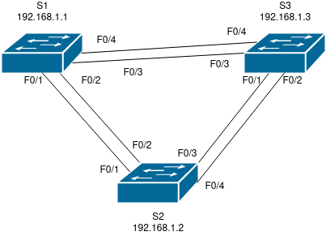

# Лабораторная работа 2.

## Цели работы

Развертывание коммутируемой сети с резервными каналами.

## Задачи

 1. Воспроизведение схемы сети (согласно Рис. 1) и базовая настройка оборудования.
 2. Выбор корневого моста.
 3. Наблюдение за процессом выбора протоколом STP порта, исходя из стоимости портов.
 4. Наблюдение за процессом выбора протоколом STP порта, исходя из приоритета портов.

--- 
 
**Рис. 1. - Схема сети**

---

**Табл. 1. - Таблица адресации**

Устройство | Интерфейс | IP-адрес | Маска
--|--|--|--
S1 | VLAN 1 | 192.168.1.1 | 255.255.255.0
S2 | VLAN 1 | 192.168.1.2 | 255.255.255.0
S3 | VLAN 1 | 192.168.1.3 | 255.255.255.0

---

Все конфигурационные файлы расположены в каталоге [cfg](./cfg/):

* [S1](./cfg/s1.txt)

* [S2](./cfg/s2.txt)

* [S3](./cfg/s3.txt)

---

## Выполнение

### Воспроизведение схемы сети

На базе Cisco Packet Tracer была подготовлена схема сети, согласно Рис. 1.

На всех сетевых устройствах была проведена базовая настройка:

1.  Устройства проименованы.

        hostname DEVICE_NAME

2. Обеспечено ограничение доступа к сетевым устройствам путем ограничения доступа к привилегированному режиму.

        enable secret ENB_PASSWORD

3. Отключена функция поиска по доменному имени.

        no ip domain-lookup

4. Ограничен доступ через консоль. Включена функция синхронизированного вывода сообщений.

        line console 0
        password LOG_PASSWORD
        login
        logging synchronous
        exit

5. Ограничен доступ через виртуальные терминалы.

        line vty 0 15
        password LOG_PASSWORD
        login
        exit

6. Обеспечена защита паролей, путем активации сервиса, отвечающего за их хранение в шифрованном виде.

        service password-encryption

7. Добавлено сообщение о недопустимости неавторизованного доступа.

        banner motd $ Unauthorized access is prohibited.$

8. Для интерфейса VLAN 1 назначен адрес в соответствии с Табл. 1. (Где IP_ADDR - адрес из таблицы, соответствующий настраиваемому устройству)

        interface VLAN 1
        ip address IP_ADDR 255.255.255.0
        no shutdown
        exit
    
> ENB_PASSWORD и LOG_PASSWORD указаны в документации к лабораторной работе.

Все вышеперечисленные действия выполнялись из режима конфигурации (`configure terminal`). 

По окончанию работ конфигурация была сохранения в файл загрузочной конфигурации (`copy running-config startup-config`).

Дополнительно при помощи команды `ping` была проверена связь между узлами `S1 -> S2`, `S1 -> S3`, `S2 -> S3`. Во всех случаях связь присутствует.

### Определение корневого моста

1. Отключаем все порты на коммутаторах.

        configure terminal
        interface range FastEthernet0/1-24
        shutdown
        exit

2. Настраиваем подключенные порты в качестве транковых.

        interface range FastEthernet0/1-4
        switchport mode trunk
        exit

3. Включаем порты F0/2 и F0/4.

        interface range FastEthernet0/2, FastEthernet0/4
        no shutdown
        exit

4. Проверяем вывод команды `show spanning-tree`.

    S1:

        VLAN0001
        Spanning tree enabled protocol ieee
        Root ID    Priority    32769
                    Address     0001.9700.8E4C
                    Cost        19
                    Port        4(FastEthernet0/4)
                    Hello Time  2 sec  Max Age 20 sec  Forward Delay 15 sec

        Bridge ID  Priority    32769  (priority 32768 sys-id-ext 1)
                    Address     00D0.58CD.EAC3
                    Hello Time  2 sec  Max Age 20 sec  Forward Delay 15 sec
                    Aging Time  20

        Interface        Role Sts Cost      Prio.Nbr Type
        ---------------- ---- --- --------- -------- --------------------------------
        Fa0/2            Altn BLK 19        128.2    P2p
        Fa0/4            Root FWD 19        128.4    P2p

    ---

    S2:

        VLAN0001
        Spanning tree enabled protocol ieee
        Root ID    Priority    32769
                    Address     0001.9700.8E4C
                    Cost        19
                    Port        4(FastEthernet0/4)
                    Hello Time  2 sec  Max Age 20 sec  Forward Delay 15 sec

        Bridge ID  Priority    32769  (priority 32768 sys-id-ext 1)
                    Address     000C.CF0A.BCA8
                    Hello Time  2 sec  Max Age 20 sec  Forward Delay 15 sec
                    Aging Time  20

        Interface        Role Sts Cost      Prio.Nbr Type
        ---------------- ---- --- --------- -------- --------------------------------
        Fa0/4            Root FWD 19        128.4    P2p
        Fa0/2            Desg FWD 19        128.2    P2p

    ---

    S3:

        VLAN0001
        Spanning tree enabled protocol ieee
        Root ID    Priority    32769
                    Address     0001.9700.8E4C
                    This bridge is the root
                    Hello Time  2 sec  Max Age 20 sec  Forward Delay 15 sec

        Bridge ID  Priority    32769  (priority 32768 sys-id-ext 1)
                    Address     0001.9700.8E4C
                    Hello Time  2 sec  Max Age 20 sec  Forward Delay 15 sec
                    Aging Time  20

        Interface        Role Sts Cost      Prio.Nbr Type
        ---------------- ---- --- --------- -------- --------------------------------
        Fa0/2            Desg FWD 19        128.2    P2p
        Fa0/4            Desg FWD 19        128.4    P2p

    Статус портов также указан в Табл. 2.

    Табл. 2 - Статус портов.
    
    Cтатус | Порт
    -- | --
    Корневой | S1:F0/4, S2:F0/4
    Назначенный | S2:F0/2, S3:F0/2, S3: F0/4
    Альтернативный | S1:F0/2

    Как мы видим, в данном случае корневым мостом был выбран S3, так как имеет наименьший BID (по MAC-адресу). Порт S1:F0/2 указан альтернативным т.к. при равных стоимостях пути BID S1 больше, чем у S2.

### Наблюдение за процессом выбора протоколом STP порта, исходя из стоимости портов.

1. Изменяем на S1 значение стоимости корневого порта (F0/4).

        configure terminal
        interface FastEthernet0/4
        spanning-tree vlan 1 cost 18
        exit

2. Проверяем статус STP на S1 и S2 командой `show spanning-tree`.

    S1:

        VLAN0001
        Spanning tree enabled protocol ieee
        Root ID    Priority    32769
                    Address     0001.9700.8E4C
                    Cost        18
                    Port        4(FastEthernet0/4)
                    Hello Time  2 sec  Max Age 20 sec  Forward Delay 15 sec

        Bridge ID  Priority    32769  (priority 32768 sys-id-ext 1)
                    Address     00D0.58CD.EAC3
                    Hello Time  2 sec  Max Age 20 sec  Forward Delay 15 sec
                    Aging Time  20

        Interface        Role Sts Cost      Prio.Nbr Type
        ---------------- ---- --- --------- -------- --------------------------------
        Fa0/2            Desg FWD 19        128.2    P2p
        Fa0/4            Root FWD 18        128.4    P2p

    ---

    S2:

        VLAN0001
        Spanning tree enabled protocol ieee
        Root ID    Priority    32769
                    Address     0001.9700.8E4C
                    Cost        19
                    Port        4(FastEthernet0/4)
                    Hello Time  2 sec  Max Age 20 sec  Forward Delay 15 sec

        Bridge ID  Priority    32769  (priority 32768 sys-id-ext 1)
                    Address     000C.CF0A.BCA8
                    Hello Time  2 sec  Max Age 20 sec  Forward Delay 15 sec
                    Aging Time  20

        Interface        Role Sts Cost      Prio.Nbr Type
        ---------------- ---- --- --------- -------- --------------------------------
        Fa0/4            Root FWD 19        128.4    P2p
        Fa0/2            Altn BLK 19        128.2    P2p

    Как видно из данного вывода, дерево было пересчитано таким образом, чтобы путь до корневого маршрутизатора имел минимальную стоимость.

3. Удаляем изменение стоимости порта F0/4 на S1.
    
        configure terminal
        interface FastEthernet0/4
        no spanning-tree vlan 1 cost 18
        exit

4. Путем повторной проверки вывода `show spanning-tree` на S1 и S2 убеждаемся в том, что пути были пересчитаны вновь и приведены к состоянию, указанному в Табл. 2.

### Наблюдение за процессор выбора протоколом STP порта, исходя из приоритета портов.

1. На всех коммутаторах включаем порты F0/1 и F0/3.

        configure terminal
        interface range FastEthernet0/1, FastEthernet0/3
        no shutdown
        exit

2. Проверяем состояние STP.

    S1:

        VLAN0001
        Spanning tree enabled protocol ieee
        Root ID    Priority    32769
                    Address     0001.9700.8E4C
                    Cost        19
                    Port        3(FastEthernet0/3)
                    Hello Time  2 sec  Max Age 20 sec  Forward Delay 15 sec

        Bridge ID  Priority    32769  (priority 32768 sys-id-ext 1)
                    Address     00D0.58CD.EAC3
                    Hello Time  2 sec  Max Age 20 sec  Forward Delay 15 sec
                    Aging Time  20

        Interface        Role Sts Cost      Prio.Nbr Type
        ---------------- ---- --- --------- -------- --------------------------------
        Fa0/1            Altn BLK 19        128.1    P2p
        Fa0/2            Altn BLK 19        128.2    P2p
        Fa0/3            Root FWD 19        128.3    P2p
        Fa0/4            Altn BLK 19        128.4    P2p

    ---

    S2:

        VLAN0001
        Spanning tree enabled protocol ieee
        Root ID    Priority    32769
                    Address     0001.9700.8E4C
                    Cost        19
                    Port        3(FastEthernet0/3)
                    Hello Time  2 sec  Max Age 20 sec  Forward Delay 15 sec

        Bridge ID  Priority    32769  (priority 32768 sys-id-ext 1)
                    Address     000C.CF0A.BCA8
                    Hello Time  2 sec  Max Age 20 sec  Forward Delay 15 sec
                    Aging Time  20

        Interface        Role Sts Cost      Prio.Nbr Type
        ---------------- ---- --- --------- -------- --------------------------------
        Fa0/4            Altn BLK 19        128.4    P2p
        Fa0/3            Root FWD 19        128.3    P2p
        Fa0/1            Desg FWD 19        128.1    P2p
        Fa0/2            Desg FWD 19        128.2    P2p

    ---

    S3:

        VLAN0001
        Spanning tree enabled protocol ieee
        Root ID    Priority    32769
                    Address     0001.9700.8E4C
                    This bridge is the root
                    Hello Time  2 sec  Max Age 20 sec  Forward Delay 15 sec

        Bridge ID  Priority    32769  (priority 32768 sys-id-ext 1)
                    Address     0001.9700.8E4C
                    Hello Time  2 sec  Max Age 20 sec  Forward Delay 15 sec
                    Aging Time  20

        Interface        Role Sts Cost      Prio.Nbr Type
        ---------------- ---- --- --------- -------- --------------------------------
        Fa0/2            Desg FWD 19        128.2    P2p
        Fa0/1            Desg FWD 19        128.1    P2p
        Fa0/3            Desg FWD 19        128.3    P2p
        Fa0/4            Desg FWD 19        128.4    P2p

    В результате данных изменений видим, что основное построение дерева осталось неизменным. При этом, изменились используемые порты. Так, S1 теперь взаимодействует с корневым коммутатором посредством порта F0/3, а F0/4 переведен в статус BLK. S2 также использует F0/3, вместо ранее используемого F0/4.
