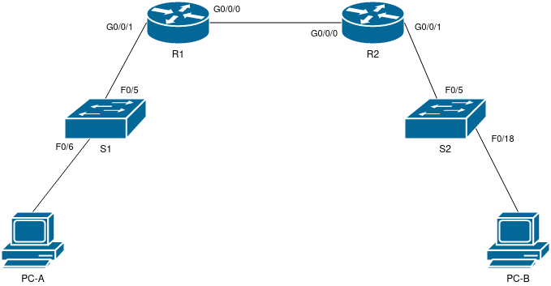

# Лабораторная работа 3 ч.1.

## Цели работы

Развертывание DHCPv4

## Задачи

 1. Воспроизведение схемы сети (согласно Рис. 1) и базовая настройка оборудования.
 2. Создание DHCPv4 сервера.
 3. Создание DHCP Relay.

--- 
 
**Рис. 1. - Схема сети**

---

**Табл. 1. - Таблица адресации**

Устройство | Интерфейс | IP-адрес | Маска | Шлюз
--|--|--|--|--
 R1 | G0/0/0 | 10.0.0.1 | 255.255.255.252 | -
 | G0/0/1 | - | - | -
 | G0/0/1.100 | 192.168.1.1 | 255.255.255.192 | -
 | G0/0/1.200 | 192.168.1.129 | 255.255.255.224 | -
 | G0/0/1.1000 | - | - | -
 R2 | G0/0/0 | 10.0.0.2 | 255.255.255.252 | -
 | G0/0/1 | 192.168.1.193 | 255.255.255.240 | -
 S1 | VLAN 200 | 192.168.1.2 | 255.255.255.192 | 192.168.1.1
 S2 | VLAN 1 | 192.168.1.194 | 255.255.255.240 | 192.168.1.193
 PC-A | NIC | DHCP | DHCP | DHCP
 PC-B | NIC | DHCP | DHCP | DHCP

 ---

**Табл. 2. - Таблица VLAN**

VLAN | Name | Iface assigned
-- | -- | --
1 | N/A | S2:F0/18
100 | Clients | S1:F0/6
200 | Management | S1:VLAN 200
999 | Parking_Lot | S1:F0/1-4, S1:F0/7-24, S1:G0/1-2
1000 | Native | N/A

---

Все конфигурационные файлы расположены в каталоге [cfg](./cfg/):

* [R1](./cfg/R1.txt)

* [R2](./cfg/R2.txt)

* [S1](./cfg/S1.txt)

* [S2](./cfg/S2.txt)

---

## Выполнение

### Проектирование адресации

Для данного задания необходимо было предварительно распределить сеть 192.168.1.0/24 на три подсети - A, B и C (58, 28 и 12 хостов соответственно). Результат представлен в Табл. 3, также на основании этих данных заполнена Табл. 1. 

Таблица 3 - Адресация в сети

Subnet N | Network/Mask | First addr | Last addr | Broadcast
--|--|--|--|--
A | 192.168.1.0/26 | 192.168.1.1 | 192.168.1.63 | 192.168.1.63
B | 192.168.1.128/27 | 192.168.1.129 | 192.168.1.158 | 192.168.1.159
C | 192.168.1.192/28 | 192.168.1.193 | 192.168.1.206 | 192.168.1.207

### Воспроизведение схемы сети

На базе Cisco Packet Tracer была подготовлена схема сети, согласно Рис. 1.

### Конфигурация маршрутизаторов

На маршрутизаторах была проведена базовая настройка:

1.  Устройства проименованы.

        hostname DEVICE_NAME

2. Отключена функция поиска по доменному имени.

        no ip domain-lookup

3. Обеспечено ограничение доступа к сетевым устройствам путем ограничения доступа к привилегированному режиму.

        enable secret ENB_PASSWORD

4. Ограничен доступ через консоль. Включена функция синхронизированного вывода сообщений.

        line console 0
        password LOG_PASSWORD
        login
        logging synchronous
        exit

5. Ограничен доступ через виртуальные терминалы.

        line vty 0 15
        password LOG_PASSWORD
        login
        exit

6. Обеспечена защита паролей, путем активации сервиса, отвечающего за их хранение в шифрованном виде.

        service password-encryption

7. Добавлено сообщение о недопустимости неавторизованного доступа.

        banner motd $ Unauthorized access is prohibited.$

8. Конфигурация сохранена в загрузочный файл

        write

9. Настроено время на устройстве

        clock set hh:mm:ss DD Month YYYY
    
> ENB_PASSWORD и LOG_PASSWORD указаны в документации к лабораторной работе.

Все вышеперечисленные действия, кроме 8-9, выполнялись из режима конфигурации (`configure terminal`). 

### Настройка маршрутизации между VLAN на R1

1. Активирован интерфейс G0/0/1

        interface GigabitEthernet0/0/1
        no shutdown
    
2. Настроен подинтерфейс для VLAN 100

        interface GigabitEthernet0/0/1.100
        encapsulation dot1q 100
        ip address 192.168.1.1 255.255.255.192
        description subuf_vl100
        exit

3. Настроен подинтерфейс для VLAN 200

        interface GigabitEthernet0/0/1.200
        encapsulation dot1q 200
        ip address 192.168.1.129 255.255.255.224
        description subuf_vl200
        exit

4. Настроен подинтерфейс для VLAN 1000

        interface GigabitEthernet0/0/1.1000
        encapsulation dot1q 1000
        description subuf_vl1000
        exit

### Настройка интерфейсов R2

1. Задан адрес на интерфейсе G0/0/1

        interface GigabitEthernet0/0/1
        ip address 192.168.1.193 255.255.255.240
        no shutdown
        exit

### Настройка статической маршрутизации между роутерами

1. Задан адрес на устройстве R1:G0/0/0

        interface GigabitEthernet0/0/0
        ip address 10.0.0.1 255.255.255.252
        no shutdown
        exit
        ip default-gateway 10.0.0.2

2. Задан адрес на устройстве R2:G0/0/0

        interface GigabitEthernet0/0/0
        ip address 10.0.0.2 255.255.255.252
        no shutdown
        exit
        ip default-gateway 10.0.0.1

### Базовая настройка коммутаторов

На коммутаторах была проведена базовая настройка:

1.  Устройства проименованы.

        hostname DEVICE_NAME

2. Отключена функция поиска по доменному имени.

        no ip domain-lookup

3. Обеспечено ограничение доступа к сетевым устройствам путем ограничения доступа к привилегированному режиму.

        enable secret ENB_PASSWORD

4. Ограничен доступ через консоль. Включена функция синхронизированного вывода сообщений.

        line console 0
        password LOG_PASSWORD
        login
        logging synchronous
        exit

5. Ограничен доступ через виртуальные терминалы.

        line vty 0 15
        password LOG_PASSWORD
        login
        exit

6. Обеспечена защита паролей, путем активации сервиса, отвечающего за их хранение в шифрованном виде.

        service password-encryption

7. Добавлено сообщение о недопустимости неавторизованного доступа.

        banner motd $ Unauthorized access is prohibited.$

8. Конфигурация сохранена в загрузочный файл

        write

9. Настроено время на устройстве

        clock set hh:mm:ss DD Month YYYY
    
> ENB_PASSWORD и LOG_PASSWORD указаны в документации к лабораторной работе.

Все вышеперечисленные действия, кроме 8-9, выполнялись из режима конфигурации (`configure terminal`). 

### Создание VLAN на S1

1. Созданы VLAN в соответствии с Табл. 2.
    
        configure terminal
        
        vlan 999
        name Parking_Lot
        exit
        
        vlan 100
        name Clients
        exit
        
        vlan 200 
        name Management
        exit

2. Интерфейсы распределены в соответствии с Табл. 2.
    
        configure terminal
        
        interface range FastEthernet0/1-4, FastEthernet0/7-24 GigabitEthernet0/1-2
        switchport mode access
        switchport access vlan 999
        exit
        
        interface FastEthernet0/6
        switchport access vlan 100
        exit

3. Создан SVI S1:VLAN200, назначен адрес в соответствии с Табл. 2.

        interface vlan 200
        ip address 192.168.1.2 255.255.255.192
        no shutdown
        exit
        
        ip default-gateway 192.168.1.1

4. Создан SVI S2:VLAN1, назначен адрес в соответствии с Табл. 2.

        interface vlan 1
        ip address 192.168.1.194 255.255.255.240
        no shutdown
        exit
        
        ip default-gateway 192.168.1.193

5. Произведено отключение всех неиспользуемых портов.

    S1:

        interface range FastEthernet0/1-4, FastEthernet0/7-24, GigabitEthernet0/1-2
        shutdown
        exit
    
    S2:

        interface range FastEthernet0/1-4, FastEthernet0/6-17, GigabitEthernet0/19-24, GigabitEthernet0/1-2
        shutdown
        exit

6. S1:F0/5 переведен в режим trunk с конфигурацией native и allowed vlan.

        interface FastEthernet0/5
        switchport mode trunk
        switchport trunk native vlan 1000
        switchport trunk allowed vlan 100,200,1000

### Настройка DHCP серверов

1. R1: Исключаем статические адреса по сетям A и C.

        ip dhcp excluded-address 192.168.1.1 192.168.1.5
        ip dhcp excluded-address 192.168.1.193 192.168.1.198

2. R1: Создаём пулы адресов и настраиваем в соответствии с ТЗ.

        ip dhcp pool NetworkA
        network 192.168.1.0 255.255.255.192
        domain-name ccna-lab.com
        lease 2 12 30
        default-router 192.168.1.1
        exit
        
        ip dhcp pool R2_Client_LAN
        network 192.168.1.192 255.255.255.240
        domain-name ccna-lab.com
        lease 2 12 30
        default-router 192.168.1.193
        exit

> lease не поддерживается Cisco Packet Tracer, поэтому в конфигурационных файлах она не представлена.

3. R2: Настройка DHCP Relay

        interface GigabitEthernet0/0/1
        ip helper-address 10.0.0.1
        exit

4. Проверяем получение адреса по DHCP на PC-B. Адрес получен успешно.
