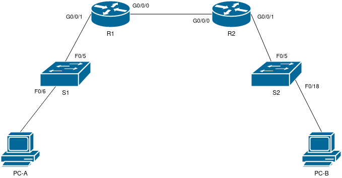

# Лабораторная работа 3 ч.2.

## Цели работы

Развертывание DHCPv6 сервера.

## Задачи

 1. Воспроизведение схемы сети (согласно Рис. 1) и базовая настройка оборудования.
 2. Подтверждение назначения адреса SLAAC от R1.
 3. Настройка и проверка работы Stateless DHCPv6 R1.
 4. Настройка и проверка работы Stateful DHCPv6 R1.
 5. Настройка и проверка работы DHCPv6 Relay на R2.

--- 
 
**Рис. 1. - Схема сети**

---

**Табл. 1. - Таблица адресации**

Устройство | Интерфейс | IP-адрес
--|--|--
R1 | G0/0/0 | 2001:db8:acad:2::1/64
|    | fe80::1
| G0/0/1 | 2001:db8:acad:1::1/64
|    | fe80::1
R2 | G0/0/0 | 2001:db8:acad:2::2/64
|    | fe80::2
| G0/0/1 | 2001:db8:acad:3::1/64
|    | fe80::1
PC-A | NIC | DHCP
PC-B | NIC | DHCP

---

Все конфигурационные файлы расположены в каталоге [cfg](./cfg/):

* [R1](./cfg/R1.txt)

* [R2](./cfg/R2.txt)

* [S1](./cfg/S1.txt)

* [S2](./cfg/S2.txt)

---

## Выполнение

### Воспроизведение схемы сети

На базе Cisco Packet Tracer была подготовлена схема сети, согласно Рис. 1.

### Базовая настройка коммутаторов

На коммутаторах была проведена базовая настройка:

1.  Устройства проименованы.

        hostname DEVICE_NAME

2. Отключена функция поиска по доменному имени.

        no ip domain-lookup

3. Обеспечено ограничение доступа к сетевым устройствам путем ограничения доступа к привилегированному режиму.

        enable secret ENB_PASSWORD

4. Ограничен доступ через консоль. Включена функция синхронизированного вывода сообщений.

        line console 0
        password LOG_PASSWORD
        login
        logging synchronous
        exit

5. Ограничен доступ через виртуальные терминалы.

        line vty 0 15
        password LOG_PASSWORD
        login
        exit

6. Обеспечена защита паролей, путем активации сервиса, отвечающего за их хранение в шифрованном виде.

        service password-encryption

7. Добавлено сообщение о недопустимости неавторизованного доступа.

        banner motd $ Unauthorized access is prohibited.$

8. Отключены все неиспользуемые порты

    S1: 

        interface range FastEthernet0/1-4, FastEthernet0/7-24, GigabitEthernet0/1-2
        shutdown
        
    S2:

        interface range FastEthernet0/1-4, FastEthernet0/6-17, FastEthernet0/19-24, GigabitEthernet0/1-2
        shutdown

> ENB_PASSWORD и LOG_PASSWORD указаны в документации к лабораторной работе.

Все вышеперечисленные действия, кроме 9, выполнялись из режима конфигурации (`configure terminal`). Конфигурация была сохранена в загрузочный в файл командой `write`.

### Конфигурация маршрутизаторов

На маршрутизаторах была проведена базовая настройка:

1.  Устройства проименованы.

        hostname DEVICE_NAME

2. Отключена функция поиска по доменному имени.

        no ip domain-lookup

3. Обеспечено ограничение доступа к сетевым устройствам путем ограничения доступа к привилегированному режиму.

        enable secret ENB_PASSWORD

4. Ограничен доступ через консоль. Включена функция синхронизированного вывода сообщений.

        line console 0
        password LOG_PASSWORD
        login
        logging synchronous
        exit

5. Ограничен доступ через виртуальные терминалы.

        line vty 0 15
        password LOG_PASSWORD
        login
        exit

6. Обеспечена защита паролей, путем активации сервиса, отвечающего за их хранение в шифрованном виде.

        service password-encryption

7. Добавлено сообщение о недопустимости неавторизованного доступа.

        banner motd $ Unauthorized access is prohibited.$

8. Включена маршрутизация IPv6

        ipv6 unicast-routing

9. Конфигурация сохранена в загрузочный файл

        write
    
> ENB_PASSWORD и LOG_PASSWORD указаны в документации к лабораторной работе.

Все вышеперечисленные действия, кроме 9, выполнялись из режима конфигурации (`configure terminal`).

### Настройка интерфейсов и маршрутизации на R1 и R2.

Произведена настройка интерфейсов согласно Табл. 1.

---

R1:

    configure terminal

    interface GigabitEthernet0/0/0
    ipv6 enable
    ipv6 address 2001:db8:acad:2::1/64
    ipv6 address fe80::1 link-local
    no shutdown
    exit

    interface GigabitEthernet0/0/1
    ipv6 enable
    ipv6 address 2001:db8:acad:1::1/64
    ipv6 address fe80::1 link-local
    no shutdown
    exit

    ipv6 route ::/0 2001:db8:acad:2::2

---

R2:

    configure terminal

    interface GigabitEthernet0/0/0
    ipv6 enable
    ipv6 address 2001:db8:acad:2::2/64
    ipv6 address fe80::2 link-local
    no shutdown
    exit

    interface GigabitEthernet0/0/1
    ipv6 enable
    ipv6 address 2001:db8:acad:3::1/64
    ipv6 address fe80::1 link-local
    no shutdown
    exit

    ipv6 route ::/0 2001:db8:acad:2::1

Посредством команды `ping 2001:db8:acad:3::1`, выполненная с R1, также произведена проверка соединения между маршрутизаторами.

### Проверка работы SLAAC на R1

На PC-A включено получение IPv6 посредством автоматической конфигурации. Получены следующие параметры:

    Physical Address................: 0060.707B.E791
    Link-local IPv6 Address.........: FE80::260:70FF:FE7B:E791
    IPv6 Address....................: 2001:DB8:ACAD:1:260:70FF:FE7B:E791/64
    Default Gateway.................: FE80::1
    DNS Servers.....................: ::
    DHCPv6 Client DUID..............: 00-01-00-01-C1-7E-25-7B-00-60-70-7B-E7-91

Как видно из адреса, часть, связанная с хостом, получена при использовании EUI-64, а т.е. - с использованием MAC адреса устройства.

### Настройка stateless DHCPv6 сервера на R1

> Все настройки выполняются из режима конфигурации устройства

1. Создаем пул с наименованием R1-STATELESS для DHCPv6 сервера на R1, указываем доменное имя и адрес dns-сервера

        ipv6 dhcp pool R1-STATELESS
        domain-name STATELESS.com
        dns-server 2001:db8:acad::254
        exit

2. Указываем на интерфейсе G0/0/1 распространение данного адреса. Также активируем флаг `O` для передачи информации о том, что с данного DHCPv6 сервера можно получить дополнительную информацию о сети.

        interface GigabitEthernet0/0/1
        ipv6 nd other-config-flag
        ipv6 dhcp server R1-STATELESS
        exit

3. Далее выходим из режима конфигурации, сохраняем изменения командой write.

4. Перезагружаем PC-A, проверяем адрес. Получен следующий вывод:

        Physical Address................: 0060.707B.E791
        Link-local IPv6 Address.........: FE80::260:70FF:FE7B:E791
        IPv6 Address....................: 2001:DB8:ACAD:1:260:70FF:FE7B:E791/64
        Default Gateway.................: FE80::1
        DNS Servers.....................: 2001:DB8:ACAD::254
        DHCPv6 IAID.....................: 974241685
        DHCPv6 Client DUID..............: 00-01-00-01-C1-7E-25-7B-00-60-70-7B-E7-91

На основании чего делаем вывод что stateless DHCPv6 сервер настроен корректно.

### Настройка stateful DHCPv6 на R1

> Все настройки выполняются из режима конфигурации устройства

1. Создаем пул с наименованием R2-STATEFUL для DHCPv6 сервера на R1, указываем префикс, доменное имя и адрес dns-сервера.

        ipv6 dhcp pool R2-STATEFUL
        address prefix 2001:db8:acad:3:aaa::/80
        dns-server 2001:db8:acad::254
        domain-name STATEFUL.com
        exit
    
2. Назначаем созданный DHCPv6 сервер на интерфейс G0/0/0.

        interface GigabitEthernet0/0/0
        ipv6 dhcp server R2-STATEFUL
        exit

3. Далее выходим из режима конфигурации и сохраняем изменения командой `write`.

### Настраиваем DHCPv6 relay на R2.

1. Настраиваем DHCPv6 relay на R2:G0/0/1. Также указываем флаг `M`, который обозначает что для клиентов на данном релее вся информация предоставляется посредством DHCPv6 сервера.

        configure terminal
        
        interface GigabitEthernet0/0/1
        ipv6 nd managed-config-flag
        ipv6 dhcp relay destination 2001:db8:acad:2::1 G0/0/0
        (CTRL+Z)
        write

2. Проверяем работу DHCPv6 клиента на PC-B через вывод `ipconfig /all`, видим, что адрес был получен непосредственно из пула R2-STATEFUL, расположенного на R1.
