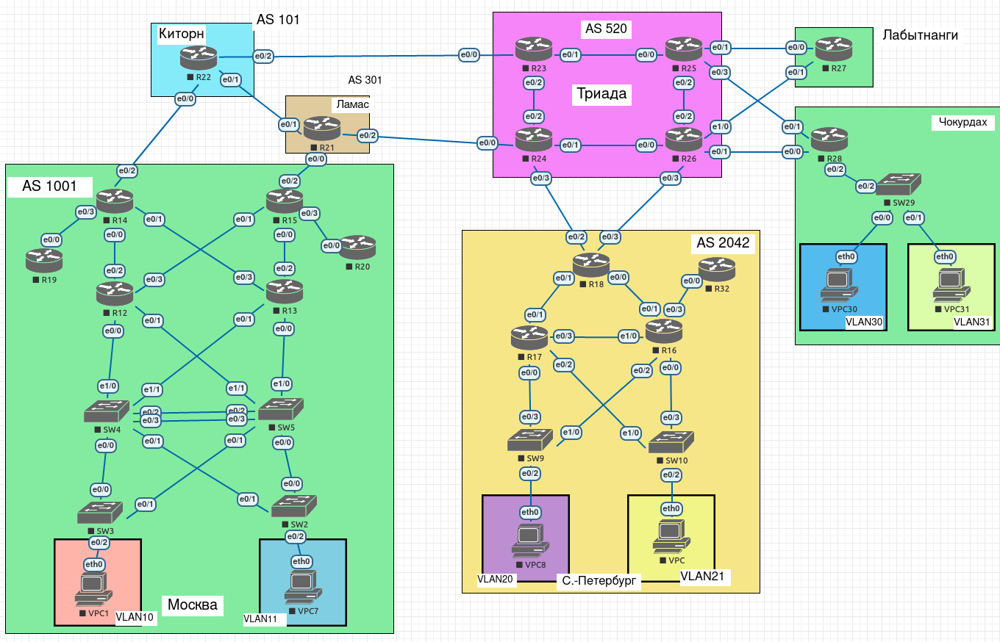

# Лабораторная работа 5.

## Цели работы

1. Настроить политику маршрутизации в офисе Чокурдах.
2. Распределить трафик между 2 линками.

## Задачи

1. Настроить политику маршрутизации для сетей офиса.
2. Распределить трафик между двумя линками с провайдером.
3. Настроить отслеживание линка через технологию IP SLA.
4. Настроить для офиса Лабытнанги маршрут по-умолчанию.

--- 
 
**Рис. 1. - Схема сети**

---

Все конфигурационные файлы расположены в каталоге [cfg](./cfg/).

---

#### Изменения в топологии в последующих работах.

Не зафиксировано.

---

#### Изменения в топологии по отношению к предыдущим работам.

Не зафиксировано.

___

## План работ

### Лабытнанги

1. Устанавливаем IP SLA на каждое соединение до провайдера.
2. В качестве маршрута по умолчанию - указываем R25.
3. Настраиваем маршруты таким образом, чтобы при отработке IP SLA, трафик шел через R26.

### Чокурдах

1. Устанавливаем IP SLA на каждое соединение до провайдера.
2. В качестве маршрута по умолчанию указываем:
    - VLAN31 : R26
    - VLAN30 : R25
3. В случае отработки IP SLA, трафик должен быть перенаправлен на альтернативный (по отношению к каждому VLAN канал)

## Выполнение

### Лабытнанги

1. Для интерфейса Ethernet0/0 подготавливаем мониторинг и запускаем его на постоянной основе.

        ip sla 1
        icmp-echo 10.255.0.38 source-ip 10.255.0.39
        frequency 10
    
        ip sla schedule 1 life forever start-time now 

        track 1 ip sla 1 reachability

2. Добавляем статический маршрут с привязкой к треку.

        ip route 0.0.0.0 0.0.0.0 Ethernet0/0 10.255.0.38 50 name R25 track 1

3. Тоже самое выполяется для Ethernet0/1.

        ip sla 2
        icmp-echo 10.255.0.42 source-ip 10.255.0.43
        frequency 10
        ip sla schedule 2 life forever start-time now
        
        track 2 ip sla 2 reachability
        
        ip route 0.0.0.0 0.0.0.0 Ethernet0/1 10.255.0.42 100 name R26 track 2

4. Проверяем перечень маршрутов, видим, что default gw - 10.255.0.38 с метрикой 50.
5. На R25 отключаем интерфейс Ethernet0/1, ждем 10 секунд.
6. Повторно проверяем перечень маршрутов, видим, что default gw - 10.255.0.42 с метрикой 100.
7. Возвращаем R25:E0/1 в исходное состояние. Проверяем маршруты, видим, что default gw вернулся к 10.255.0.38.

### Чокурдах

Здесь считаем по умолчанию маршрут движения пакетов следующий:

    - Стандарт: R25:Eth0/3
    - Альтернативный: R26:Eth0/1

1. Устанавливаем мониторинг на оба канала (1 - R28:Eth0/1, 2 - R28:Eth0/0).

        ip sla 1
        icmp-echo 10.255.0.40 source-ip 10.255.0.41
        frequency 10
        
        ip sla schedule 1 life forever start-time now
        
        track 1 ip sla 1 reachability
        
        ip sla 2
        icmp-echo 10.255.0.44 source-ip 10.255.0.45
        frequency 10
        
        ip sla schedule 2 life forever start-time now
        
        track 2 ip sla 2 reachability

2. Устанавливаем стандартную маршрутизацию, без оглядки на VLAN.

        ip route 0.0.0.0 0.0.0.0 Ethernet0/1 10.255.0.40 50 name R25 track 1
        ip route 0.0.0.0 0.0.0.0 Ethernet0/0 10.255.0.44 100 name R26 track 2
    
3. Настраиваем route-map для VLAN. Несмотря на то, что логика базовой маршрутизации повторяет логику VLAN30, считаем что есть ненулевая веронятность изменения либо логики базовой маршрутизации, либо VLAN30, а потому - все равно настраиваем route-map.

    1. Создаем access-list`ы для VLAN30 и VLAN31.
    
            ip access-list standard ACL-VLAN30
            permit 10.3.1.72 0.0.0.7
            deny any
            ip access-list standard ACL-VLAN31
            permit 10.3.1.80 0.0.0.7
            deny any
        
    2. Создаем route-map`ы с указанием очередности хопов и проверкой на доступ.
    
            route-map RM-VLAN30 permit 10
            match ip address ACL-VLAN30
            set ip next-hop verify-availability 10.255.0.40 40 track 1
            set ip next-hop verify-availability 10.255.0.44 90 track 2
                                    
            route-map RM-VLAN31 permit 10
            match ip address ACL-VLAN31
            set ip next-hop verify-availability 10.255.0.44 40 track 2
            set ip next-hop verify-availability 10.255.0.40 90 track 1
        
    3. Назначаем route-map на интерфейсы.
    
            interface Ethernet0/2.30
            ip policy route-map RM-VLAN30
            exit
            
            interface Ethernet0/2.31
            ip policy route-map RM-VLAN31
            exit
        
Таким образом, трафик с разных vlan распределяется между разными провайдерами, при этом каждый из данных vlan имеет резервный канал на случай падения основного. Помимо этого, трафик, который не относится к VLAN30/VLAN31, также идет с резервом.
