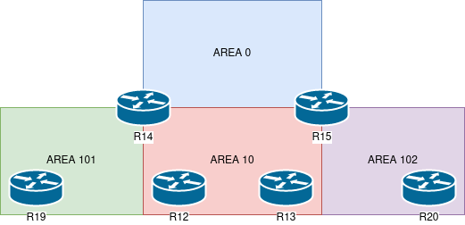

# Лабораторная работа 6.

## Цели работы

1. Настроить OSPF в офисе Москва.
    1. Разделить сеть на зоны.
    2. Настроить фильтрацию между зонами.

## Задачи

1. Маршрутизаторы R14-R15 находятся в зоне 0 - backbone.
2. Маршрутизаторы R12-R13 находятся в зоне 10. Дополнительно к маршрутам должны получать маршрут по-умолчанию.
3. Маршрутизатор R19 находится в зоне 101 и получает только маршрут по умолчанию.
4. Маршрутизатор R20 находится в зоне 102 и получает все маршруты, кроме маршрутов до сетей зоны 101.
5. План работы и изменения зафиксированы в документации.

## План работ

1. Определить типы зон.
2. Включить ospf на интерфейсах, в соответствии с зонами.
3. Настройка фильтрации для R20.

--- 
 
**Рис. 1. - Общая схема сети.**

---

**Рис. 2. - Схема зон OSPF. Москва.**

---

**Табл. 1. - Таблица Router ID.**

| Маршрутизатор | ID |
| :--: | :--: |
| R12 | 1.1.255.252 | 
| R13 | 1.1.255.253 |
| R14 | 1.1.255.255 |
| R15 | 1.1.255.254 |
| R19 | 1.1.255.251 |
| R20 | 1.1.255.250 |

---

**Табл. 2. - Таблица интерфейсов с разбивкой по зонам.**

| Маршрутизатор | Интерфейс | Зона |
| :--: | :-- | :-- |
| R12 | | |
| | Ethernet0/2 | 10 |
| | Ethernet0/3 | 10 |
| R13 | | |
| | Ethernet0/2 | 10 |
| | Ethernet0/3 | 10 |
| R14 | | |
| | Ethernet0/0 | 10 |
| | Ethernet0/1 | 10 |
| | Ethernet0/2 | 0 |
| | Ethernet0/3 | 101 |
| R15 | | |
| | Ethernet0/0 | 10 |
| | Ethernet0/1 | 10 |
| | Ethernet0/2 | 0 |
| | Ethernet0/3 | 102 |
| R19 | | |
| | Ethernet0/0 | 101 |
| R20 | | |
| | Ethernet0/0 | 102 |

---

**Табл. 3. - Типы зон.**

| Номер | Тип |
| :-- | :-- |
| 0 | Backbone/Standard |
| 10 | Stub |
| 101 | Totally stub |
| 102 | Stub |

---

Все конфигурационные файлы расположены в каталоге [cfg](./cfg/).

---

#### Изменения в топологии в последующих работах.

1. Лабораторная работа 9. [Исправление OSPF на площадке Москва](../lab_9)

---

#### Изменения в топологии по отношению к предыдущим работам.

Не зафиксировано.

___

## Выполнение

### Определить типы зон.

1. Определены типы зон, в соответствии с условиями задачи и перечислены в Табл. 3. Стоит отметить, что:
    - В соответствии с условиями задания, зона 101 отмечается как totally stub (для блокировки передачи маршрутов из других зон посредством LSA3, при сохранении маршрута по умолчанию).
    - Зоны 10 и 102 отмечены как stub, т.к. каждая из них должна получать все маршруты (в т.ч. - по умолчанию) и ни одна из них за собой не имеет ABR/ASBR.

### Включить ospf на интерфейсах, в соответствии с зонами.

1. Для создания процесса OSPF, а также назначения router-id на каждом из маршрутизаторов площадки Москва были выполнены следующие команды:

        router ospf 1
        router-id <ID>

    Где `<ID>` - ID в соответствии с Табл. 1.

2. Также, на каждом из маршрутизаторов включен ospf на интерфейсах командой `ip ospf 1 area <AREA-NUM>`, где `<AREA-NUM>` - номер зоны из Табл. 2. соответственно интерфейсу и маршрутизатору.

3. Зоны 10, 101, 102 настроены на маршрутизаторах в соответствии с типом из Табл. 3.

### Настройка фильтрации для R20.

1. На R15 настраиваем префикс лист:

        ip prefix-list Area102Filter deny 10.255.0.8/31
        ip prefix-list Area102Filter permit 0.0.0.0/0 le 32

2. На R15 в настройках ospf подтягиваем данный список в качестве фильтра:

        area 102 filter-list prefix Area102Filter in

3. Проверяем через некоторое время повторно маршруты на R20, видим, что маршрут до 10.255.0.8/31 пропал, при том что все остальные маршруты остались неизменными.
