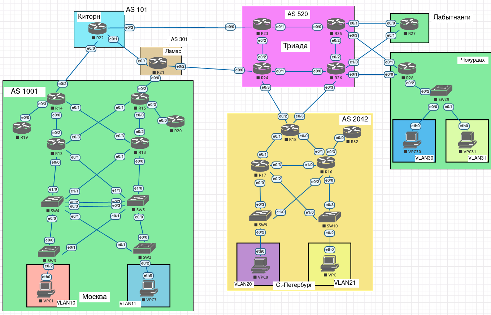
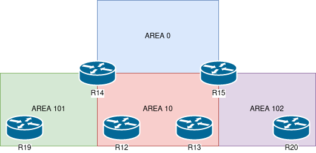

# Лабораторная работа 7.

## Цели работы

1. Настроить OSPF IPv6 в офисе Москва.
    1. Разделить сеть на зоны.
    2. Настроить фильтрацию между зонами.

## Задачи

1. Маршрутизаторы R14-R15 находятся в зоне 0 - backbone.
2. Маршрутизаторы R12-R13 находятся в зоне 10. Дополнительно к маршрутам должны получать маршрут по-умолчанию.
3. Маршрутизатор R19 находится в зоне 101 и получает только маршрут по умолчанию.
4. Маршрутизатор R20 находится в зоне 102 и получает все маршруты, кроме маршрутов до сетей зоны 101.
5. План работы и изменения зафиксированы в документации.

## План работ

1. Включить ospf v3 на интерфейсах, в соответствии с зонами.
2. Настройка фильтрации для R20.

--- 
 
**Рис. 1. - Общая схема сети.**

---

**Рис. 2. - Схема зон OSPF. Москва.**

---

**Табл. 1. - Таблица Router ID.**

| Маршрутизатор | ID |
| :--: | :--: |
| R12 | 1.1.255.252 | 
| R13 | 1.1.255.253 |
| R14 | 1.1.255.255 |
| R15 | 1.1.255.254 |
| R19 | 1.1.255.251 |
| R20 | 1.1.255.250 |

---

**Табл. 2. - Таблица интерфейсов с разбивкой по зонам.**

| Маршрутизатор | Интерфейс | Зона |
| :--: | :-- | :-- |
| R12 | | |
| | Ethernet0/2 | 10 |
| | Ethernet0/3 | 10 |
| R13 | | |
| | Ethernet0/2 | 10 |
| | Ethernet0/3 | 10 |
| R14 | | |
| | Ethernet0/0 | 10 |
| | Ethernet0/1 | 10 |
| | Ethernet0/2 | 0 |
| | Ethernet0/3 | 101 |
| R15 | | |
| | Ethernet0/0 | 10 |
| | Ethernet0/1 | 10 |
| | Ethernet0/2 | 0 |
| | Ethernet0/3 | 102 |
| R19 | | |
| | Ethernet0/0 | 101 |
| R20 | | |
| | Ethernet0/0 | 102 |

---

**Табл. 3. - Типы зон.**

| Номер | Тип |
| :-- | :-- |
| 0 | Backbone/Standard |
| 10 | Stub |
| 101 | Totally stub |
| 102 | Stub |

---

Все конфигурационные файлы расположены в каталоге [cfg](./cfg/).

---

#### Изменения в топологии в последующих работах.

1. Лабораторная работа 9. [Исправление OSPF на площадке Москва](../lab_9)

---

#### Изменения в топологии по отношению к предыдущим работам.

Не зафиксировано.

___

## Выполнение

### Включить ospf на интерфейсах, в соответствии с зонами.

1. Для создания процесса OSPF, а также назначения router-id на каждом из маршрутизаторов площадки Москва были выполнены следующие команды:

        ipv6 router ospf 1
        router-id <ID>

    Где `<ID>` - ID в соответствии с Табл. 1.

2. Также, на каждом из маршрутизаторов включен ospf на интерфейсах командой `ipv6 ospf 1 area <AREA-NUM>`, где `<AREA-NUM>` - номер зоны из Табл. 2. соответственно интерфейсу и маршрутизатору.

3. Зоны 10, 101, 102 настроены на маршрутизаторах в соответствии с типом из Табл. 3.

### Настройка фильтрации для R20.

1. На R15 настраиваем префикс лист:

        ipv6 prefix-list Area102-v6-Filter deny 2020::1:0:5:0/120
        ipv6 prefix-list Area102-v6-Filter permit ::0/0 le 128
    
2. На R15 в настройках ospf v3 подтягиваем данный список в качестве фильтра:

        area 102 filter-list prefix Area102-v6-Filter in

3. Проверяем через некоторое время повторно маршруты на R20, видим, что маршрут до 2020::1:0:5:1/120 пропал, при том что все остальные маршруты остались неизменными.
