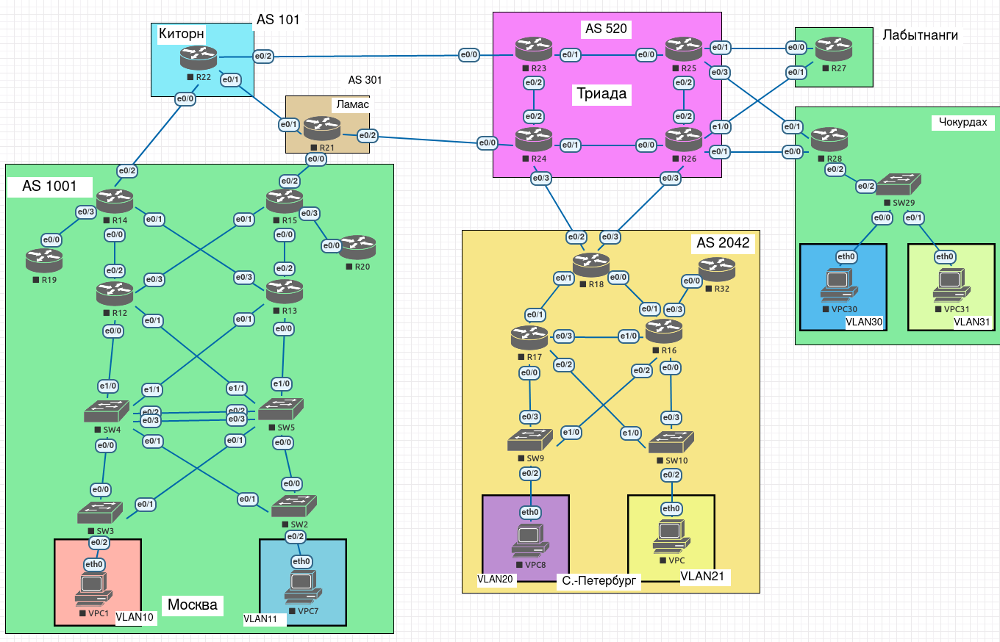

# Лабораторная работа 8.

## Цели работы

- Построение сети и проверка соединения.
- Настройка маршрутизации EIGRP.
- *EIGRP расширенный
    - Создание сети и настройка основных параметров устройства.
    - Настройка EIGRP и проверка подключения.
    - Настройка EIGRP для автоматического суммирования.
    - Настройка и распространение статического маршрута по умолчанию.

## Задачи

В этой лабораторной работе необходимо настроить EIGRP:

1. EIGRP в части схемы СПБ.
2. EIGRP использует суммарные маршруты, для оптимизации протокола.
3. Используется распределение нагрузки по всем возможным линкам.
4. Аналогичную работу реализовать для IPv6.

Дополнительно:

- Использовать расширенный (именованный) EIGRP для IPv4 и IPv6 вместо стандартной настройки.

## План работ

1. Создание связки ключей для аутентификации EIGRP.
2. Включение EIGRP на маршрутизаторе.
3. Создание именованных семейств адресов.
4. Настройка суммаризации маршрутов и распределения трафика.
5. Настройка и распространение статического маршрута по умолчанию.

--- 
 
**Рис. 1. - Общая схема сети.**

---

**Табл. 1. - Таблица Router ID.**

Маршрутизатор | ID
--- | ---
R16 | 1.1.254.254
R17 | 1.1.254.253
R18 | 1.1.254.255
R32 | 1.1.254.252

---

**Табл. 2. - Активные интерфейсы EIGRP.**

Маршрутизатор | Интерфейс
--- | ---
R16 |
| Ethernet0/1
| Ethernet0/3
| Ethernet1/0
R17 |
| Ethernet0/1
| Ethernet0/3
R18 |
| Ethernet0/0
| Ethernet0/1
R32 |
| Ethernet0/0

---

**Табл. 3. - Интерфейсы с суммаризацией EIGRP.**

Маршрутизатор | Интерфейс
--- | ---
R16 |
| Ethernet 0/1
| Ethernet 0/3
| Ethernet 1/0
R17 |
| Ethernet 0/1
| Ethernet 0/3

---

Все конфигурационные файлы расположены в каталоге [cfg](./cfg/).

---

#### Изменения в топологии в последующих работах.

1. Лабораторная работа 9. [Дополнение EIGRP на площадке С.-Петербург](../lab_9)

---

#### Изменения в топологии по отношению к предыдущим работам.

Не зафиксировано.

___

## Выполнение

- Все ниже приведенные пункты выполняются на всех роутерах площадки С.-Петербург, из-под привелегированного режима.
- Работа выполняется с учетом пункта о применении EIGRP Named mode.
- Также, в рамках данной работы посредством динамической маршрутизации опубликованы loopback адреса маршрутизаторов, для чего они были переконфигурированы из /24 в /32.

### Создание связки ключей для аутентификации EIGRP

	key chain <KEYCHAIN_NAME>
	key 1
	key-string 7 <PASSWORD>

В данном блоке мы создаем связку ключей с наименованием `<KEYCHAIN_NAME>`, внутри которой создаем ключ с id == 1 и задаем ему строку `<PASSWORD>` с шифрованием.

> Стоит отметить что в `show running-config` пароль остался чистым текстом.

### Включение EIGRP на маршрутизаторе

+ `router eigrp SPBInstance`

Создается только один инстанс, т.к. он будет работать со всеми типами адресов, которые мы зададим в следующем пункте.

### Создание именованных семейств адресов

Не выходя из настройки маршрутизации EIGRP выполняем следующее:

	address-family ipv4 unicast autonomous-system <AS_NUMBER>
	eigrp router-id <ROUTER-ID>
	network <NETWORK> <WILDCARD>
	
	af-interface default
	authentication mode md5
	authentication key-chain <KEYCHAIN_NAME>
	passive-interface
	
	exit-af-interface
	
	exit-address-family
	
	address-family ipv6 unicast autonomous-system <AS_NUMBER>
	eigrp router-id <ROUTER-ID>
	
	af-interface default
	authentication mode md5
	authentication key-chain <KEYCHAIN_NAME>
	passive-interface
	exit-af-interface

	exit-address-family

Данной командой мы создаем два блока address family (для ipv4 и ipv6 соответственно) для автономной системы с номером `<AS_NUMBER>`. В них предварительно задаются следующие параметры:

- Router-ID (В соответствии с Табл. 1)
- Для IPv4: Подсети, которые мы включаем в маршрутизацию. В данном случае были включены все подсети, кроме loopback адресов (см. Табл. 2 и Табл. 3 [Лабораторной работы 4](https://bitbucket.org/4xlan/otus_neteng_202006/src/master/lab_4))
- Конфигурация всех интерфейсов по умолчанию:
	- Настройка аутентификации (использование хэширования md5 + использование связки ключей)
	- Назначение интерфейсов пассивными

> Cisco в [статье о настройке Named EIGRP](https://www.cisco.com/c/en/us/support/docs/ip/enhanced-interior-gateway-routing-protocol-eigrp/200156-Configure-EIGRP-Named-Mode.html) говорит о том, что для запуска процесса маршрутизации необходимо явно набирать `no shutdown`, но в данном случае все поднялось само.

+ Далее, внутри каждой address family отдельно явным образом включаем интерфейсы для EIGRP, отключая параметр `passive-interface` (в соотв. с Табл. 2).

        af-interface <IFNAME>
        no passive-interface
        exit-af-interface

+ Командами `show ip route eigrp` и `show ipv6 route eigrp` проверяем наличие маршрутов.

### Настройка суммаризации маршрутов и распределения трафика.

+ На всех маршрутизаторах внутри блока настройки EIGRP инстанса выполняем следующее:

        address-family ipv4 unicast autonomous-system <AS_NUMBER>
        topology base
        maximum-paths 10
        exit-af-topology
        exit-address-family
       
        address-family ipv4 unicast autonomous-system <AS_NUMBER>
        topology base
        maximum-paths 10
        exit-af-topology
        exit-address-family

    Тем самым мы перешли в режим настройки топологии для IPv4 и IPv6 задали распределение трафика между максимум 10 возможными узлами (при их наличии).
        
    > Для площадки C.-Петербург на текущей топологии достаточно значения `maximum-paths 2`, но указываем с запасом, не исключая возможности расширения сети.
    
+ Проверяем распределение трафика между узлами посредством трассировки VPC (10.2.21.11) с R18:

        R18>traceroute 10.2.21.11
        Type escape sequence to abort.
        Tracing the route to 10.2.21.11
        VRF info: (vrf in name/id, vrf out name/id)
        1 10.255.0.14 0 msec
            10.255.0.18 1 msec
            10.255.0.14 0 msec
        2 10.2.21.11 1 msec 1 msec 0 msec
  
    Как видно из вывода - трафик пошел через R17 (10.255.0.18) и R16 (10.255.0.14).

+ Для настройки суммаризации вновь переходим в конфигурацию `address-family ipv4` и для каждого перечисленного интерфейса у перечисленных маршрутизаторов (Табл. 3) выполняем следующее:

        af-interface <IFNAME>
        summary-address 10.2.0.0 255.255.0.0
        exit-af-interface

    В данном случае выполняем суммирование выделенной подсети для С.-Петербург и транслируем их как на горизонтально расположенные маршрутизаторы (R32, R16<=>R17), так и на вышестоящие (R18).
    
    Командой `show ip route eigrp` на R16 и R17 проверяем наличие суммирования (с интерфейсом `Null0`), далее на R18 проверяем что приходит действительно суммированный маршрут (вывод сокращен):
    
        R18#sh ip ro
        
        // --- //
        
        S*  0.0.0.0/0 [245/0] via 10.255.0.23, Ethernet0/3
            10.0.0.0/8 is variably subnetted, 15 subnets, 3 masks
        D   10.2.0.0/16 [90/1536000] via 10.255.0.18, 00:00:36, Ethernet0/1
                        [90/1536000] via 10.255.0.14, 00:00:36, Ethernet0/0

### Настройка и распространение статического маршрута по умолчанию

+ Убираем на всех маршрутизаторах площадки командой `no ip route 0.0.0.0 0.0.0.0`.
+ На R18 задаем статические маршруты, предполагается что маршрут до R26 задан как основной маршрут по умолчанию, а R24 - как запасной.

        ip route 0.0.0.0 0.0.0.0 Ethernet0/3 10.255.0.23 245 name R26
        ip route 0.0.0.0 0.0.0.0 Ethernet0/2 10.255.0.21 250 name R24
        ipv6 route ::/0 Ethernet0/3 fe80::1:26:3 245 name R26
        ipv6 route ::/0 Ethernet0/2 fe80::1:24:3 250 name R24

+ Также на R18 в блоке настройки EIGRP выполняем следующее:

        address-family ipv4 unicast autonomous-system <AS_NUMBER>
        redistribute static
        exit-af-topology
        exit-address-family
        
        address-family ipv6 unicast autonomous-system <AS_NUMBER>
        redistribute static
        exit-af-topology
        exit-address-family

+ Проверяем таблицы маршрутизации IPv4 и IPv6 на другом маршрутизаторе сети (в данном случае - R32, вывод сокращен)

        R32>sh ip ro  

        // --- //

        Gateway of last resort is 10.255.0.16 to network 0.0.0.0

        D*EX  0.0.0.0/0 [170/2048000] via 10.255.0.16, 00:27:43, Ethernet0/0

        // --- //

        R32>sh ipv6 ro

        // --- //

        EX  ::/0 [170/1536512]
            via FE80::1:16:3, Ethernet0/0

        // --- //

Из данного вывода видим, что в таблицах маршрутизации R32 есть маршруты EIGRP External (`EX`) до подсетей `0.0.0.0/0` и `::/0`, по адресам которых можно явно сказать что они относятся к R16:Ethernet0/3 (линк до R26).
