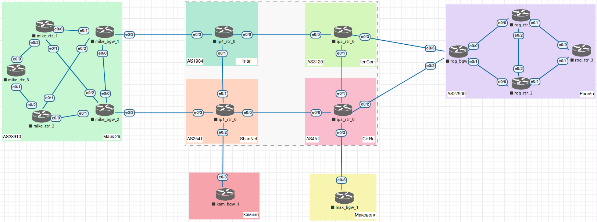

# Проектная работа.
# Организация сети до удаленных филиалов компании.

## Цели работы

Настроить соединение с удаленными филиалами компаниями.

--- 
 
**Рис. 1. - Общая схема сети.**

---

Все конфигурационные файлы расположены в каталоге [cfg](./cfg/).

---

## Выполнение

### Вводные данные

В данной работе будет рассмотрена настройка сети между головным офисом и удаленными филиалами. Конфигурация будет проведена на примере ООО "Ультор". Данная организация имеет головной офис, а также 3 филиала разной степени отдаленности. На данный момент площадки между собой не соединены, но каждая точка присутствия уже имеет несконфигурированный выход в сеть Интернет как минимум посредством одного соединения. Головной офис, а также один из филиалов имеют номера автономных систем, остальные два филиала имеют просто статический белый IP-адрес. Доступ в сеть Интернет обеспечивают 4 провайдера. Задачу необходимо решить использованием штатных средств имеющегося оборудования.

### Описание планируемых работ

Ввиду простоты инфраструктуры как филиалов, так и головного офиса, в качестве протокола маршрутизации выбираем OSPF.

Учитывая однородность оборудования, представленного на площадках, принято решение обеспечить туннели между площадками посредством DMVPN. В дальнейшем это позволит также гибко настраивать новые площадки, в случае их появления. Маршрутизацию внутри туннелей будет обеспечивать EIGRP ввиду хорошего соотношения простоты настройки и обслуживания к скорости сходимости. Также, в целях сохранения конфиденциальности информации, дополнительно будет использовано шифрование посредством IPSec с применением (с аутентификацией по RSA ключу).

Для поддержки аутентификации IPSec нам потребуется удостоверяющий центр, учитывая цели работы - мы можем использовать самоподписанные сертификаты, не прибегая к услугам внешних аккредитованных удостоверяющих центров и для нужд создания УЦ выделим сервер mike_rtr_3. Для доступа к данному серверу извне, пробросим порт 80 на адресе max_bgw_1.

> ! Так как организация сети провайдера и обеспечение соединения между провайдерами не входят в тему проектной работы, узлы данных сущностей представлены схематично.

### Предварительная конфигурация

1. [Планирование адресного пространства](./desc/1_addr.md)
2. [Предварительная общая конфигурация устройств стенда](./desc/2_preconf.md)
3. [Настройка внутренней маршрутизации и обеспечение доступа в сеть Интернет](./desc/3_int_routing.md)
4. [Настройка маршрутизации между площадками](./desc/4_ext_routing.md)

### Выполнение проектной работы

1. [Настройка NTP](./desc/5_ntp.md)
2. [Настройка УЦ](./desc/6_ca.md)
3. [Настройка DMVPN](./desc/7_dmvpn.md)
4. [Настройка IPSec](./desc/8_ipsec.md)
5. [Настройка маршрутизации внутри DMVPN](./desc/9_eigrp.md)

### Выводы

* [Заключение](./desc/10_fin.md)
